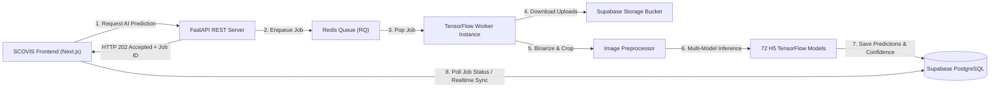

# SCOVIS Backend — Async AI Scoring & REST API Engine

[](https://www.python.org/)
[](https://fastapi.tiangolo.com/)
[](LICENSE)

> Asynchronous microservice engine and AI inference pipeline for **SCOVIS (Score Classification Oversight and Intelligence System)**. Powers direct image-based handwritten exam score classification with a 72-model TensorFlow ensemble and Redis/RQ job queue.

---

## 📌 Overview

**SCOVIS Backend** is an asynchronous REST API and background worker framework engineered to process handwritten student assessment sheets. Built with **FastAPI** and **Redis Queue (RQ)**, the backend offloads heavy deep learning inference from web HTTP handlers to background worker processes, ensuring responsive client interactions.

The AI engine executes a **72-model TensorFlow ensemble pipeline** (`Models_New`), running specialized image preprocessing, region-of-interest cropping, and score classification models on student submissions while syncing state with Supabase PostgreSQL and Storage buckets.

---

## ✨ Key Features

- ⚡ **Asynchronous Worker Queue**: Decoupled HTTP API and AI worker execution via Redis & RQ to handle heavy ML processing without blocking requests.
- 🧠 **72-Model AI Pipeline**: Executes specialized Keras/TensorFlow H5 model ensembles targeting specific score box regions on exam sheets.
- 🖼️ **Non-Inverted Image Preprocessing**: Enforces binarization and adaptive thresholding (black handwriting on white background) for feature extraction.
- 🛡️ **Human-in-the-Loop Safeguards**: Generates classification predictions with confidence scores for lecturer verification rather than final automated grading.
- 🗄️ **Supabase Integration**: Securely fetches student uploads from Supabase Storage buckets via signed URLs and writes evaluation results to PostgreSQL tables.
- 🐳 **Containerized Setup**: Docker Compose configurations (`compose.yaml`) with Caddy reverse proxy for TLS termination.

---

## 🛠️ Tech Stack

### Language & API Layer
- **Python** (3.10+)
- **FastAPI** (ASGI Web Framework)
- **Uvicorn** (ASGI Production Server)

### AI & Image Processing
- **TensorFlow** (2.15+ / Keras)
- **OpenCV & Pillow** (Adaptive Thresholding & Cropping)
- **NumPy** (Tensor Manipulations)

### Task Queue & Data Layer
- **Redis** & **RQ** (Redis Queue Worker)
- **Supabase** (PostgreSQL Database & Storage Buckets)

### Infrastructure
- **Docker** & **Docker Compose**
- **Caddy** (TLS Reverse Proxy)

---

## 🏗️ System Architecture



---

## 📂 Project Structure

```text
scovis-backend/
├── main.py                   # FastAPI REST API entry point & endpoints
├── worker.py                 # RQ worker process entry point
├── config.py                 # Application settings & environment loader
├── api_models.py             # Pydantic schemas & response models
├── domain.py                 # Business domain models & enums
├── Caddyfile                 # Caddy reverse proxy configuration
├── compose.yaml              # Docker Compose production orchestration
├── compose.local.yaml        # Local development Docker Compose
├── Dockerfile.api            # Docker container build for API
├── Dockerfile.worker         # Docker container build for RQ Worker
├── Models_New/               # 72 TensorFlow H5 trained models
├── services/
│   ├── class_mapping.py      # Score class index mapping
│   ├── image_service.py      # Image processing utilities
│   ├── model_loader.py       # H5 model loader
│   ├── model_manifest.py     # Model manifest registry
│   ├── model_registry.py     # Model registration & metadata
│   ├── prediction_service.py # Core ML prediction logic
│   ├── preprocess.py         # Adaptive thresholding & image binarization
│   ├── queue_service.py      # Redis/RQ job queue dispatcher
│   ├── settings_service.py   # App settings service
│   └── tasks.py              # RQ worker background task definitions
├── repositories/             # Database access layer
├── tests/                    # API & inference test suites
└── requirements-api.txt      # Production API dependencies
```

---

## 🚀 Getting Started

### Prerequisites
- Python 3.10+
- Redis Server (local instance or Docker container)

### Environment Setup

Create a `.env` file in the root directory:

```env
ENV=development
REDIS_URL=redis://localhost:6379/0
SUPABASE_URL=https://<your-project-ref>.supabase.co
SUPABASE_SERVICE_ROLE_KEY=<your-service-role-key>
MAX_CONCURRENT_WORKERS=1
```

### Local Development

1. **Install Dependencies**:
   ```bash
   pip install -r requirements-api.txt -r requirements-worker.txt
   ```

2. **Start Redis**:
   ```bash
   docker run -d -p 6379:6379 --name redis redis:7-alpine
   ```

3. **Launch API Server**:
   ```bash
   uvicorn main:app --reload --host 127.0.0.1 --port 8000
   ```

4. **Launch Background Worker**:
   ```bash
   python worker.py
   ```

5. **API Documentation**:
   Access interactive Swagger docs at `http://127.0.0.1:8000/docs`.

---

## 📌 Project Status

**Academic / Research Project** — Developed as part of Undergraduate Thesis (Tugas Akhir) research.

---

## 📄 License

This repository is maintained as part of the SCOVIS academic and engineering project.
