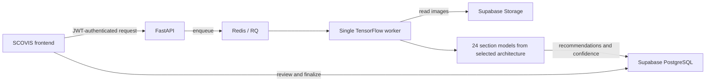

# SCOVIS Backend

[](https://www.python.org/)
[](https://fastapi.tiangolo.com/)
[](https://www.tensorflow.org/)

FastAPI, Redis/RQ, and TensorFlow backend for **SCOVIS**, a human-in-the-loop handwritten-answer score-classification system.

- **Public API:** [api.103-58-100-208.sslip.io](https://api.103-58-100-208.sslip.io)
- **Frontend repository:** [RaihanHadriansyah21/scovis-frontend](https://github.com/RaihanHadriansyah21/scovis-frontend)

## Overview

The backend separates lightweight HTTP handling from memory-intensive model inference:

1. FastAPI authenticates and validates a prediction request.
2. The API enqueues an RQ job and returns `202 Accepted` with a job identifier.
3. A dedicated worker downloads the required answer-section images, preprocesses them, runs the selected model family, and writes prediction results to Supabase.
4. The frontend presents those recommendations to a lecturer for review, correction, and finalization.

The repository contains **72 H5 artifacts**: three backbone architectures across 24 answer sections. They are alternative section-specific model sets, not a 72-model ensemble. A prediction job uses the 24 section models belonging to the selected architecture.

## Architecture



## Implemented capabilities

- 31 FastAPI routes covering prediction jobs, health/readiness, administration, audit, roster aggregation, and diagnostics.
- Redis/RQ queue dispatch with one active AI worker, per-submission locking, bounded retry, and stale-job reconciliation.
- TensorFlow/Keras model registry with manifest validation and lazy model loading.
- Non-inverted binary preprocessing: black handwriting on a white background, replicated to three channels and resized for the selected backbone.
- Supabase Auth verification, PostgreSQL access, private Storage downloads, and trusted result writes.
- Individual and batch job flows with terminal status reporting.
- Docker Compose deployment with separate API, worker, Redis, and Caddy services.
- Ruff, pytest, dependency, database, image-build, manifest, and golden-runtime quality gates.

## Model evidence and limitations

The checked-in manifest and golden inference files establish artifact identity and runtime compatibility. They do **not** establish production accuracy, generalization, or calibrated confidence.

Notebook validation metrics are maintained as research evidence and should be interpreted as fixed-split validation results. Lecturer review remains part of the product workflow.

## Technology

| Area | Main tools |
| --- | --- |
| API and validation | Python 3.12, FastAPI, Uvicorn, Pydantic |
| Queue and recovery | Redis 8, RQ, JSON serialization |
| AI runtime | TensorFlow/Keras, OpenCV, Pillow, NumPy |
| Data services | Supabase Auth, PostgreSQL, Storage |
| Deployment | Docker Compose, Caddy, GitHub Actions |
| Quality | Ruff, pytest, `pip check`, Supabase CLI checks |

## Repository map

```text
main.py                    FastAPI entry point and route registration
worker.py                  RQ worker entry point and readiness checks
config.py                  Validated environment configuration
services/                  Queue, preprocessing, model, prediction, and settings services
repositories/              Database access layer
supabase/                  Local database configuration, migrations, and tests
tests/                     API, service, security, and regression tests
Models_New/                Runtime manifest and model-contract evidence
compose.yaml               Production service topology
compose.local.yaml         Local resource and port overrides
Dockerfile.api             API image
Dockerfile.worker          TensorFlow worker image
```

## Local setup

### Prerequisites

- Docker Desktop with Docker Compose
- The 72 H5 files expected by `Models_New/manifest.json`
- A Supabase project configured with the required schema, Storage policies, and RPC functions

### Configuration

Copy `.env.example` to `.env`, then replace every placeholder. `SUPABASE_SECRET_KEY` is server-side only and must never be exposed to a browser or committed.

### Run with Docker Compose

```bash
docker compose -f compose.yaml -f compose.local.yaml up --build api worker redis
```

The API is exposed locally at `http://127.0.0.1:8000`; interactive documentation is available at `/docs`.

### Local validation

```bash
python -m pip install -r requirements-api.txt -r requirements-worker.txt -r requirements-dev.txt
ruff check .
pytest
python -m pip check
```

Model-dependent tests require artifacts that match the runtime manifest.

## Project status

Active undergraduate thesis project. The public readiness endpoint currently checks Supabase, Redis, worker availability, and stale dependencies. Remaining research work includes broader end-to-end rehearsal evidence, upload-boundary testing, and independent dataset-to-model lineage verification.

No open-source license file is currently included in this repository.
