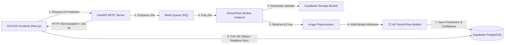

# SCOVIS Backend — High-Performance Async AI Scoring & API Engine

[](https://www.python.org/)
[](https://fastapi.tiangolo.com/)
[](https://python-rq.org/)
[](https://www.tensorflow.org/)
[](https://supabase.com)
[](https://www.docker.com/)

> Asynchronous microservice engine and AI inference pipeline for **SCOVIS (Score Classification Oversight and Intelligence System)**. Powers direct image-based handwritten exam score classification with a 72-model TensorFlow ensemble and Redis/RQ job queue.

---

## 📌 Overview

**SCOVIS Backend** is an enterprise-grade REST API and asynchronous worker framework engineered to process handwritten student assessment sheets. Built with **FastAPI** and **Redis Queue (RQ)**, the backend offloads heavy deep learning inference from web HTTP handlers to dedicated background workers, ensuring zero-blocking client responsiveness.

The AI engine executes a **72-model TensorFlow ensemble pipeline** (`Models_New`), running specialized binarization, region-of-interest cropping, and score classification models on student submissions while syncing state with Supabase PostgreSQL and Storage buckets.

---

## ✨ Key Features

- ⚡ **Asynchronous Worker Queue**: Decoupled HTTP API and AI worker execution via Redis & RQ to handle heavy ML processing without blocking requests.
- 🧠 **72-Model AI Pipeline**: Executes specialized Keras/TensorFlow H5 model ensembles targeting specific score box regions on exam sheets.
- 🖼️ **Non-Inverted Image Preprocessing**: Enforces binarization and adaptive thresholding (black handwriting on white background) for optimal feature extraction.
- 🛡️ **Human-in-the-Loop Safeguards**: Generates classification predictions with confidence scores for lecturer verification rather than final automated grading.
- 🗄️ **Supabase Integration**: Securely fetches raw student uploads from Supabase Storage buckets via signed URLs and writes evaluation results directly to PostgreSQL tables.
- 🐳 **Docker & Reverse Proxy Ready**: Pre-configured Docker Compose orchestrations (`compose.yaml`) with Caddy reverse proxy for automated HTTPS SSL certificates.

---

## 🛠️ Tech Stack

**Language & Core**
- Python 3.10+
- FastAPI (ASGI Framework)
- Uvicorn (Production Server)

**AI & Deep Learning**
- TensorFlow 2.15+ / Keras
- OpenCV & Pillow (Image Binarization & Cropping)
- NumPy (Tensor Manipulations)

**Async Queue & Caching**
- Redis
- RQ (Redis Queue)

**Database & Storage**
- Supabase PostgreSQL (Database & RPC)
- Supabase Storage (Signed URLs)

**DevOps & Infrastructure**
- Docker & Docker Compose
- Caddy (TLS Reverse Proxy)

---

## 🏗️ System Architecture



---

## 📂 Project Structure

```text
scovis-backend/
├── main.py                   # FastAPI REST API entry point & endpoints
├── worker.py                 # RQ worker process entry point
├── config.py                 # Application settings & environment loader
├── api_models.py             # Pydantic schemas & response models
├── domain.py                 # Business domain models & enums
├── Caddyfile                 # Caddy reverse proxy configuration
├── compose.yaml              # Production Docker Compose orchestration
├── compose.local.yaml        # Local development Docker Compose
├── Dockerfile.api            # Docker container build for API
├── Dockerfile.worker         # Docker container build for RQ Worker
├── Models_New/               # 72 TensorFlow H5 trained models
├── services/
│   ├── binarization_service.py # Adaptive thresholding & image preprocessing
│   ├── crop_service.py         # Exam sheet ROI extraction
│   ├── inference_service.py    # TensorFlow model execution engine
│   └── storage_service.py      # Supabase Storage signed URL handler
├── repositories/             # Database access layer
├── tests/                    # API & inference test suites
└── requirements-api.txt      # Production API dependencies
```

---

## 🚀 Getting Started

### Prerequisites
- Python 3.10+
- Redis Server (local instance or Docker container)
- Docker Desktop (optional, for containerized run)

### Environment Setup

Create a `.env` file in the root directory:

```env
ENV=development
REDIS_URL=redis://localhost:6379/0
SUPABASE_URL=https://<your-project-ref>.supabase.co
SUPABASE_SERVICE_ROLE_KEY=<your-service-role-key>
MAX_CONCURRENT_WORKERS=1
```

### Local Development Setup

1. **Install Dependencies**:
   ```bash
   pip install -r requirements-api.txt -r requirements-worker.txt
   ```

2. **Start Redis Server**:
   ```bash
   docker run -d -p 6379:6379 --name redis redis:7-alpine
   ```

3. **Launch FastAPI Development Server**:
   ```bash
   uvicorn main:app --reload --host 127.0.0.1 --port 8000
   ```

4. **Launch Async RQ Worker**:
   ```bash
   python worker.py
   ```

5. **Access Interactive API Docs**:
   Navigate to `http://127.0.0.1:8000/docs` in your browser.

---

## 🧪 Verification & Testing

Run automated tests and health checks:

```bash
# Execute test suite
pytest tests/

# Run system verification proofs
python run_proofs.py
```

Check system health via API:
```bash
curl http://127.0.0.1:8000/health
```

---

## 📄 License

This repository is maintained as part of the SCOVIS academic and engineering project.
