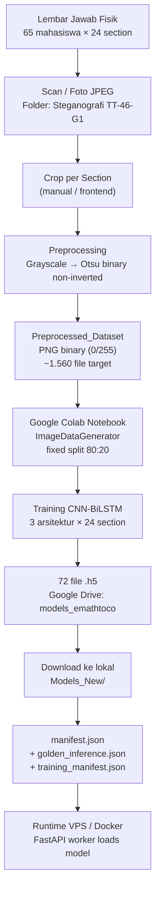

# Draft Lineage — 72 Model H5 E-MATHTOCO

> Tanggal: 2026-07-18
> Sumber: `training_manifest.json`, `manifest.json`, `golden_inference.json`, `Preprocessing.ipynb`
> Evidence level: **B** — lineage direkonstruksi dari metadata repository, bukan dari log training langsung.

## Diagram Lineage

## Tahap Lineage Detail

### Tahap 1: Pengumpulan Data

| Atribut | Nilai |
|---|---|
| Sumber | Lembar jawab ujian matematika tulisan tangan |
| Mata kuliah | Steganografi TT-46-G1 |
| Jumlah subjek (dari notebook) | 65 mahasiswa |
| Jumlah section per lembar | 24 (S-1A s.d. S-4F) |
| Format asli | JPEG (scan/foto) |
| Lokasi Google Drive | `Steganografi TT-46-G1` |

### Tahap 2: Preprocessing

| Atribut | Nilai |
|---|---|
| Input | Crop JPEG per section |
| Langkah 1 | Convert to grayscale |
| Langkah 2 | Otsu binary threshold (non-inverted) |
| Output | PNG single-channel, pixel values {0, 255} |
| Polaritas | Black ink on white background |
| Lokasi output | `Preprocessed_Dataset/{NIM}/{score}/{NIM}_{section}_{score}.png` |
| Notebook referensi | `Preprocessing.ipynb` (non-authoritative — polarity mismatch) |
| Sampel terverifikasi | 2 file SHA-256 dikonfirmasi binary non-inverted |

### Tahap 3: Training

| Atribut | Nilai |
|---|---|
| Platform | Google Colab |
| Data loader | `tf.keras.preprocessing.image.ImageDataGenerator` |
| Color mode | RGB (default — binary image replicated to 3 channels) |
| Split | Fixed 80:20 (train:validation) |
| Total notebook | 72 (3 arsitektur × 24 section) |
| Lokasi notebook | `Models_New/{Architecture}/Notebook/` |
| Dataset path (Colab) | `/content/drive/MyDrive/2026-Caps02/Dataset/Preprocessed_Dataset` |

### Tahap 4: Model Output

| Arsitektur | Input Shape | Preprocess Function | Jumlah H5 |
|---|---|---|---|
| MobileNetV2 | 224×224×3 | `tf.keras.applications.mobilenet_v2.preprocess_input` | 24 |
| DenseNet121 | 224×224×3 | `tf.keras.applications.densenet.preprocess_input` | 24 |
| InceptionV3 | 299×299×3 | `tf.keras.applications.inception_v3.preprocess_input` | 24 |

Output per model: softmax layer dengan jumlah neuron sesuai jumlah kelas section tersebut (4, 5, atau 6).

### Tahap 5: Export dan Registrasi

| Atribut | Nilai |
|---|---|
| Format | Keras H5 (`.h5`) |
| Lokasi training | `/content/drive/MyDrive/models_emathtoco/{Architecture}/model_{section}.h5` |
| Training manifest | `training_manifest.json` — 72 entries dengan SHA-256 dan size |
| Golden inference | `golden_inference.json` — 72 entries dengan sample prediction |
| Lokasi lokal | `Models_New/{Architecture}/model_{section}.h5` |
| Runtime manifest | `manifest.json` — 72 entries enriched dengan class_labels, preprocessing, golden SHA |

### Tahap 6: Runtime

| Atribut | Nilai |
|---|---|
| Server | FastAPI + Redis/RQ worker |
| Model loader | `services/model_registry.py` → LRU cache |
| Preprocessing runtime | Binary non-inverted → nearest resize → Keras preprocess_input |
| Manifest reader | `services/model_manifest.py` |
| Class mapping | `services/class_mapping.py` → `CLASS_SCORE_MAP` |

---

## Tabel 72 Artifacts

### MobileNetV2

| # | Section | H5 File | Training Path (Colab) | SHA-256 (first 16) | Size | Classes |
|---|---|---|---|---|---|---|
| 1 | S-1A | model_1a.h5 | .../MobileNetV2/model_1a.h5 | 2600ed7188d346b0 | 14196712 | 4 |
| 2 | S-1B | model_1b.h5 | .../MobileNetV2/model_1b.h5 | 38c1159c202c0c84 | 14197224 | 5 |
| 3 | S-1C | model_1c.h5 | .../MobileNetV2/model_1c.h5 | fb024a40ec1a2e9d | 14197224 | 5 |
| 4 | S-1D | model_1d.h5 | .../MobileNetV2/model_1d.h5 | 2fd090ff0e758442 | 14197224 | 5 |
| 5 | S-1E | model_1e.h5 | .../MobileNetV2/model_1e.h5 | 3ed8507716e76069 | 14197224 | 5 |
| 6 | S-1F | model_1f.h5 | .../MobileNetV2/model_1f.h5 | 29e5bd1dd01cae33 | 14197736 | 6 |
| 7 | S-2A | model_2a.h5 | .../MobileNetV2/model_2a.h5 | d07db42ca83fe04f | 14197224 | 5 |
| 8 | S-2B | model_2b.h5 | .../MobileNetV2/model_2b.h5 | 04c1bbbb34010421 | 14196712 | 4 |
| 9 | S-2C | model_2c.h5 | .../MobileNetV2/model_2c.h5 | 416c55708b82e7b7 | 14197224 | 5 |
| 10 | S-2D | model_2d.h5 | .../MobileNetV2/model_2d.h5 | b72944d6e9326341 | 14197224 | 5 |
| 11 | S-2E | model_2e.h5 | .../MobileNetV2/model_2e.h5 | 7d1754e3d25d7a77 | 14197224 | 5 |
| 12 | S-2F | model_2f.h5 | .../MobileNetV2/model_2f.h5 | e131de5af8f3741c | 14197736 | 6 |
| 13 | S-3A | model_3a.h5 | .../MobileNetV2/model_3a.h5 | d2f3781bca09bca4 | 14197224 | 5 |
| 14 | S-3B | model_3b.h5 | .../MobileNetV2/model_3b.h5 | abbe78bd445edf6c | 14197224 | 5 |
| 15 | S-3C | model_3c.h5 | .../MobileNetV2/model_3c.h5 | 44abfab5b0b6042f | 14197224 | 5 |
| 16 | S-3D | model_3d.h5 | .../MobileNetV2/model_3d.h5 | cb9bcb7e60d3b9ea | 14197224 | 5 |
| 17 | S-3E | model_3e.h5 | .../MobileNetV2/model_3e.h5 | 76da58c301017281 | 14197224 | 5 |
| 18 | S-3F | model_3f.h5 | .../MobileNetV2/model_3f.h5 | 23058c473359baf7 | 14197224 | 5 |
| 19 | S-4A | model_4a.h5 | .../MobileNetV2/model_4a.h5 | 1814b962b0231531 | 14197224 | 5 |
| 20 | S-4B | model_4b.h5 | .../MobileNetV2/model_4b.h5 | 8093fedad5d65915 | 14197224 | 5 |
| 21 | S-4C | model_4c.h5 | .../MobileNetV2/model_4c.h5 | 8f8c3f9e3c6a7f05 | 14197224 | 5 |
| 22 | S-4D | model_4d.h5 | .../MobileNetV2/model_4d.h5 | 1813f82cd7069056 | 14197224 | 5 |
| 23 | S-4E | model_4e.h5 | .../MobileNetV2/model_4e.h5 | 8ec0bf0c98f5fd23 | 14197224 | 5 |
| 24 | S-4F | model_4f.h5 | .../MobileNetV2/Section_4f.h5 | 5dba14221a49107b | 14197736 | 6 |

### DenseNet121

| # | Section | H5 File | SHA-256 (first 16) | Size | Classes |
|---|---|---|---|---|---|
| 25 | S-1A | model_1a.h5 | c1c856721ba18a03 | 33852192 | 4 |
| 26 | S-1B | model_1b.h5 | e2abc14ccf6d1f81 | 33852704 | 5 |
| 27 | S-1C | model_1c.h5 | 36e498e04e34c129 | 33852704 | 5 |
| 28 | S-1D | model_1d.h5 | a0ee7e0f35c92825 | 33852704 | 5 |
| 29 | S-1E | model_1e.h5 | c325447ea83d693e | 33852704 | 5 |
| 30 | S-1F | model_1f.h5 | 9829dd6db55b3e94 | 33853216 | 6 |
| 31 | S-2A | model_2a.h5 | c9ec912410ab194f | 33852704 | 5 |
| 32 | S-2B | model_2b.h5 | 124399807c78b999 | 33852192 | 4 |
| 33 | S-2C | model_2c.h5 | 0d41da53e4d02aa1 | 33852704 | 5 |
| 34 | S-2D | model_2d.h5 | a67b7532a353abc2 | 33852704 | 5 |
| 35 | S-2E | model_2e.h5 | 77c57f81b70ec2ff | 33852704 | 5 |
| 36 | S-2F | model_2f.h5 | 3c22d30d15c3e8d0 | 33853216 | 6 |
| 37 | S-3A | model_3a.h5 | ee2380784787ef93 | 33852704 | 5 |
| 38 | S-3B | model_3b.h5 | 9ce2652b62e9ea7f | 33852704 | 5 |
| 39 | S-3C | model_3c.h5 | 8e12ed4d573adee5 | 33852704 | 5 |
| 40 | S-3D | model_3d.h5 | c34f0679a892b43a | 33852704 | 5 |
| 41 | S-3E | model_3e.h5 | f764b48cd5ba8cb5 | 33852704 | 5 |
| 42 | S-3F | model_3f.h5 | 29b57197d7c5d4cd | 33852704 | 5 |
| 43 | S-4A | model_4a.h5 | 9422fa36dcb8f298 | 33852704 | 5 |
| 44 | S-4B | model_4b.h5 | a0fdf3fee80b0499 | 33852704 | 5 |
| 45 | S-4C | model_4c.h5 | 261eada52fd20519 | 33852704 | 5 |
| 46 | S-4D | model_4d.h5 | 1cd561078f5aed01 | 33852704 | 5 |
| 47 | S-4E | model_4e.h5 | 2cf8a59945e06a39 | 33852704 | 5 |
| 48 | S-4F | model_4f.h5 | a49310e3aeaeab66 | 33853216 | 6 |

### InceptionV3

| # | Section | H5 File | SHA-256 (first 16) | Size | Classes |
|---|---|---|---|---|---|
| 49 | S-1A | model_1a.h5 | 576791fdb7063e5d | 93608680 | 4 |
| 50 | S-1B | model_1b.h5 | c9839dd924818c5e | 93609192 | 5 |
| 51 | S-1C | model_1c.h5 | 5919a3f55325e427 | 93609192 | 5 |
| 52 | S-1D | model_1d.h5 | 8b916c8100a0ca0c | 93609192 | 5 |
| 53 | S-1E | model_1e.h5 | 688bd632e5c3f59f | 93609192 | 5 |
| 54 | S-1F | model_1f.h5 | 285a4fdf147a5cf6 | 93609704 | 6 |
| 55 | S-2A | model_2a.h5 | f4e215f31d7c8a5b | 93609192 | 5 |
| 56 | S-2B | model_2b.h5 | 9bd423d0996d3c7e | 93608680 | 4 |
| 57 | S-2C | model_2c.h5 | 4c69d4ce5b61782d | 93609192 | 5 |
| 58 | S-2D | model_2d.h5 | 72c31befb72a2668 | 93609192 | 5 |
| 59 | S-2E | model_2e.h5 | 276c92a226213809 | 93609192 | 5 |
| 60 | S-2F | model_2f.h5 | 110146592d641315 | 93609704 | 6 |
| 61 | S-3A | model_3a.h5 | 72b4c4219e9685d2 | 93609192 | 5 |
| 62 | S-3B | model_3b.h5 | 7cbcdf42b8024b86 | 93609192 | 5 |
| 63 | S-3C | model_3c.h5 | 30eb64bd17fc0814 | 93609192 | 5 |
| 64 | S-3D | model_3d.h5 | e6ba68dd6ed38d98 | 93609192 | 5 |
| 65 | S-3E | model_3e.h5 | 6966f9ab3f46c57c | 93609192 | 5 |
| 66 | S-3F | model_3f.h5 | 4be7ed158444e471 | 93609192 | 5 |
| 67 | S-4A | model_4a.h5 | 61cf1bc5243a8466 | 93609192 | 5 |
| 68 | S-4B | model_4b.h5 | 3d72fd709073421a | 93609192 | 5 |
| 69 | S-4C | model_4c.h5 | ab4540134786ae80 | 93609192 | 5 |
| 70 | S-4D | model_4d.h5 | 6de3875498957736 | 93609192 | 5 |
| 71 | S-4E | model_4e.h5 | 5e0284d78b76e97a | 93609192 | 5 |
| 72 | S-4F | model_4f.h5 | bae983e4b2674335 | 93609704 | 6 |

---

## Gap Lineage yang Belum Ditutup

| Gap | Status | Dampak |
|---|---|---|
| Preprocessing notebook (Preprocessing.ipynb) memiliki polarity mismatch dengan dataset aktual | Diketahui, runtime sudah diperbaiki | Lineage notebook → dataset tidak 1:1 |
| Listing file Preprocessed_Dataset belum tersedia | Belum diverifikasi | Jumlah file aktual vs 1.560 belum pasti |
| Split train/val by-student belum dibuktikan | Belum diverifikasi | Potensi data leakage |
| Rekonsiliasi 1.560 vs 1.536 | Hipotesis (64 vs 65 subjek) | Lihat `reconciliation_1560_vs_1536.md` |
